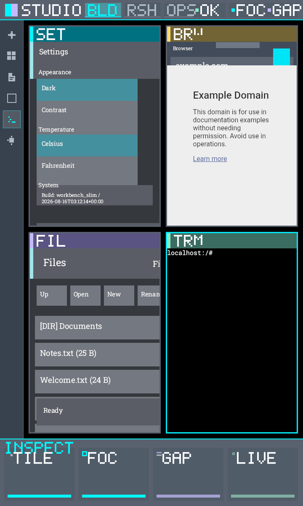
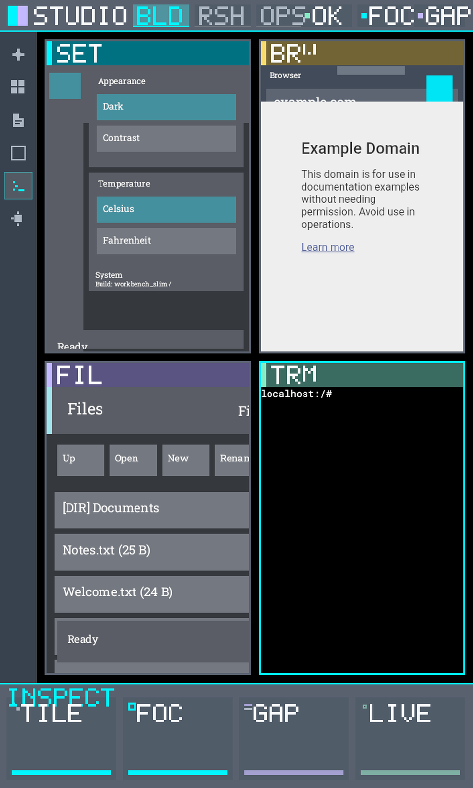
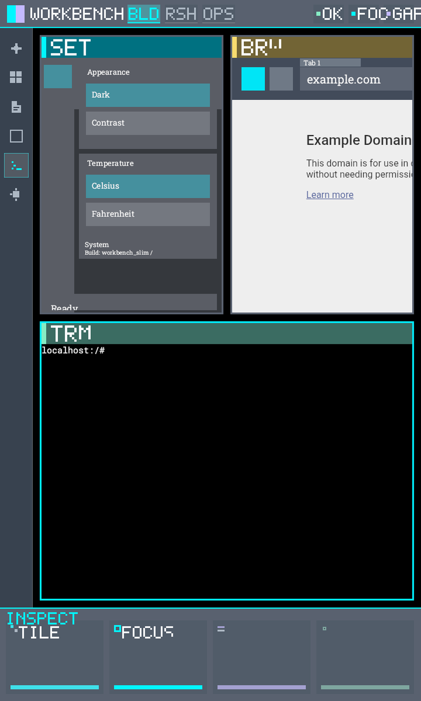
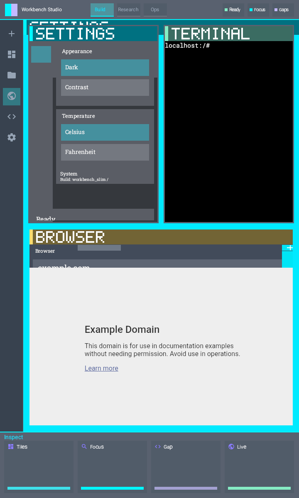
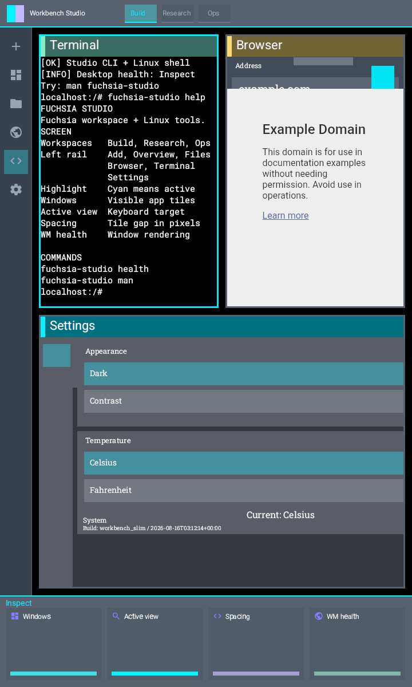

# Fuchsia Desktop Instrument Studio

Public package for a **native Fuchsia** desktop direction: Workbench + Flatland + interactive tiling window manager + four system apps, with Instrument Studio UI design sketches.

This repository does **not** vendor the multi-gigabyte Fuchsia tree, SDK, emulator images, or runtime state. It publishes the overlays, scripts, design artifacts, and instructions needed to rebuild on top of public Fuchsia sources.

## Security boundary

- No private keys, tokens, `.env` secrets, or `authorized_keys` material are included.
- `state/`, `sdk/`, `source/`, `artifacts/`, and caches are gitignored and must stay local.
- CI runs a fail-closed secret scan on every push.

If you find credential-like material, open an issue and rotate immediately.

## What you get

- `overlays/fuchsia/**`: native desktop overlays
  - interactive `tiling_wm` with confirmed-focus policy
  - Browser / Files / Settings / Terminal / panel spike components
  - Workbench session product wiring
- `scripts/**`: bootstrap, overlay apply, verification helpers
- `design/sketches/**`: interactive HTML directions for richer UI
- `design/screenshots/**`: Instrument Studio / palette / overview captures
- `docs/donor-roadmap.md`: native-only roadmap adapted from mature Rust WMs
- GitHub Actions CI for public-readiness gates

## Pinned baseline

See `versions.env`:

- Fuchsia source: `7f75b7f6ffdacf5a818dd8d207263edd45126ddd`
- Product target: `//products/workbench:workbench_slim.x64`

## Design direction

We are building **Instrument Studio** first:

1. shared native desktop chrome
2. confirmed-focus active window treatment
3. live WM settings surface
4. command palette and spatial overview as progressive layers

### Screenshots












Interactive sketches live under `design/sketches/`.

## Run the desktop

This repository is an overlay package. Cloning it does not boot a desktop. There is no emulator image, SDK, or product bundle in git.

The system this package produces is **Workbench slim on FEMU**. The commands below are the ones the live verifiers actually use. `scripts/start-emulator.sh` is not that path: it only starts QEMU `workbench_eng.x64` or `minimal.x64`.

### What has to exist first

- Linux x86_64 host with KVM (`/dev/kvm`) and rootless Podman
- A lab workspace that already has the SDK, Fuchsia source at the pin in `versions.env`, overlays applied, and a built slim bundle
- Container name `fuchsia-desktop-mvp`, isolate dir `/workspace/state/ffx`

On the lab used to develop this package, that workspace is `/srv/bigs-runtime/workspaces/projects/fuchsia-desktop-mvp`. The public clone of this repo is not a substitute for that lab.

Built bundle the guest actually boots:

```text
/workspace/source/fuchsia/out/workbench_eng.x64-release/obj/products/workbench/workbench_slim.x64/product_bundle
```

If that directory is missing, do the Local rebuild steps below, then come back here.

### 1. Start the tool container if it is not running

From the lab workspace, not from a docs-only clone:

```bash
podman compose up -d
podman ps --filter name=fuchsia-desktop-mvp --format '{{.Names}} {{.Status}}'
```

Expected: `fuchsia-desktop-mvp` is `Up`.

Helper used in every later command:

```bash
ffx() {
  podman exec -e FUCHSIA_NODENAME=fuchsia-workbench-femu fuchsia-desktop-mvp     /workspace/sdk/packages/tools/x64/ffx --isolate-dir /workspace/state/ffx "$@"
}
```

### 2. Boot FEMU, or reuse it if it is already running

```bash
ffx emu list
```

If the list shows `[running] fuchsia-workbench-femu`, do not start another copy.

If it is not running:

```bash
ffx emu start   --engine femu --gpu swiftshader_indirect --accel hyper --headless   --net user --smp 8 --name fuchsia-workbench-femu --startup-timeout 180   --log /workspace/artifacts/fuchsia-workbench-femu.log   /workspace/source/fuchsia/out/workbench_eng.x64-release/obj/products/workbench/workbench_slim.x64/product_bundle
```

The guest is headless. There is no local window and no VNC in this path. You look at it with `ffx target screenshot`.

### 3. Prove the guest is reachable

```bash
ffx target wait -t 180
ffx emu list
ffx target list
ffx target ssh "echo FUCHSIA_GUEST_OK"
```

Expected:

- emulator line `[running] fuchsia-workbench-femu`
- target `fuchsia-workbench-femu` in Product state with RCS `Y`
- guest prints `FUCHSIA_GUEST_OK`

### 4. Put the desktop on the stage

A fresh slim boot can be an empty tiling WM (`tile_count=0`). Add the apps the current live proof uses:

```bash
ffx session add fuchsia-pkg://fuchsia.com/fuchsia_settings#meta/fuchsia_settings.cm
ffx session add fuchsia-pkg://fuchsia.com/fuchsia_terminal#meta/fuchsia_terminal.cm
ffx session add fuchsia-pkg://fuchsia.com/fuchsia_browser#meta/fuchsia_browser.cm
```

Files is part of the product, but the current live proof is three tiles because Files PresentView is not restored. Do not treat `Running` as a four-window desktop.

Check the window manager:

```bash
ffx --machine json inspect show core/session-manager/session:session/tiling_wm
```

Expected: `tiling_wm.tile_count` is 3 and `fuchsia.inspect.Health.status` is `OK`.

Capture pixels:

```bash
ffx target screenshot -d /workspace/artifacts/instrument-studio-run
```

The PNG lands in the lab `artifacts/` directory on the host.

### 5. Use it as an end user inside Terminal

The Terminal is Alpine/Linux through Starnix. After Terminal has focus:

```sh
fuchsia-studio help
fuchsia-studio health
fuchsia-studio man
```

That is the in-guest help surface. Desktop health still comes from Inspect, not from those Linux commands.

### Stop

```bash
ffx emu stop fuchsia-workbench-femu
```

Do not run that if another session is using the same guest.

## Local rebuild

### 1. Get public Fuchsia source at the pin

```bash
./scripts/fetch-fuchsia-source.sh ./source/fuchsia
```

Or follow upstream docs and check out the commit in `versions.env`.

### 2. Apply overlays

```bash
./scripts/apply-overlays.sh ./source/fuchsia
```

### 3. Configure and build Workbench slim

Inside your Fuchsia tree / container workflow:

```bash
fx set workbench_eng.x64 --release
fx build //products/workbench:workbench_slim.x64
```

Exact containerized flow used during development is documented in `docs/architecture.md` and the helper scripts under `scripts/`.

### 4. Optional runtime verification

With an emulator/session and local `sdk/` + `artifacts/` layout available:

```bash
./scripts/verify-tiling-wm-interaction.sh
./scripts/verify-tiling-wm-lifecycle.sh
./scripts/verify-slim-product.sh
```

These scripts will not fully run in a docs-only checkout without local fetches.

## Optional Starnix agent path

The agent-linux overlay is included without credentials.

1. Create your own keypair locally.
2. Install the public key using `authorized_keys.template` as a guide.
3. Export:

```bash
export AGENT_SSH_KEY=/absolute/path/to/private_key
export AGENT_KNOWN_HOSTS=/absolute/path/to/known_hosts
```

Never commit those files.

## Repository layout

```text
overlays/fuchsia/     # files to copy onto a Fuchsia checkout
scripts/              # fetch/apply/verify/secret-scan helpers
design/sketches/      # HTML UI directions
design/screenshots/   # PNG captures referenced by README
docs/                 # architecture + donor roadmap
.github/workflows/    # CI
versions.env          # pins
```

## Instrument Studio UI path

Shared native UI contracts live in `overlays/fuchsia/src/fuchsia-desktop/desktop_ui`.
Region/token mapping: `docs/instrument-studio-ui-map.md`.

Host contract test:

```bash
python3 scripts/test-desktop-ui-host.py
```

## Observability feedback loop

Instrument Studio development uses Fuchsia diagnostics as the feedback channel:

```bash
./scripts/collect-desktop-diagnostics.sh ./artifacts/diagnostics-run
cat ./artifacts/diagnostics-run/design-feedback.json
```

See `docs/observability-feedback-loop.md` for the Inspect tree and design checks.

## Linux terminal

Workbench terminal bridges to Alpine/Linux via Starnix and installs a bounded `fuchsia-studio` help, health, and manual command inside the Linux console. See `docs/linux-terminal.md`.

## Production status

See `docs/production-status.md` for an honest done/not-done gate.

## Live demo evidence

Rebuild proof + vision notes:

- Latest Live 22: `docs/evidence/instrument-studio-help-20260827T062745Z/`
  proves the new chrome, built-in help, Inspect health, confirmed Terminal focus,
  and three visible tiles. Files is absent.
- Historical Live 4: `docs/evidence/instrument-studio-20260818T220823Z/`
  proves four tiles, confirmed focus, and gap/border configuration before the
  current typography and help changes.

## Status

The interactive tiling WM, Instrument Studio shell chrome, readable typography, semantic icons, and Linux help surface are proven on their cited source identities. The next proof is to restore Files and re-establish an exact-current four-tile stage before release-polish claims.
