# Fuchsia Desktop Instrument Studio

Public package for a **native Fuchsia** desktop direction: Workbench + Flatland + interactive tiling window manager + four system apps, with Instrument Studio UI design sketches.

This repository does **not** vendor the multi-gigabyte Fuchsia tree, SDK, emulator images, or runtime state. It publishes the overlays, scripts, design artifacts, and instructions needed to rebuild on top of public Fuchsia sources.

## Security boundary

- No private keys, tokens, `.env` secrets, or `authorized_keys` material are included.
- `state/`, `sdk/`, `source/`, `artifacts/`, and caches are gitignored and must stay local.
- CI runs a fail-closed secret scan on every push.

If you find credential-like material, open an issue and rotate immediately.

## What you get

- `overlays/fuchsia/**`: native desktop overlays
  - interactive `tiling_wm` with confirmed-focus policy
  - Browser / Files / Settings / Terminal / panel spike components
  - Workbench session product wiring
- `scripts/**`: bootstrap, overlay apply, verification helpers
- `design/sketches/**`: interactive HTML directions for richer UI
- `design/screenshots/**`: Instrument Studio / palette / overview captures
- `docs/donor-roadmap.md`: native-only roadmap adapted from mature Rust WMs
- GitHub Actions CI for public-readiness gates

## Pinned baseline

See `versions.env`:

- Fuchsia source: `7f75b7f6ffdacf5a818dd8d207263edd45126ddd`
- Product target: `//products/workbench:workbench_slim.x64`

## Design direction

We are building **Instrument Studio** first:

1. shared native desktop chrome
2. confirmed-focus active window treatment
3. live WM settings surface
4. command palette and spatial overview as progressive layers

### Screenshots

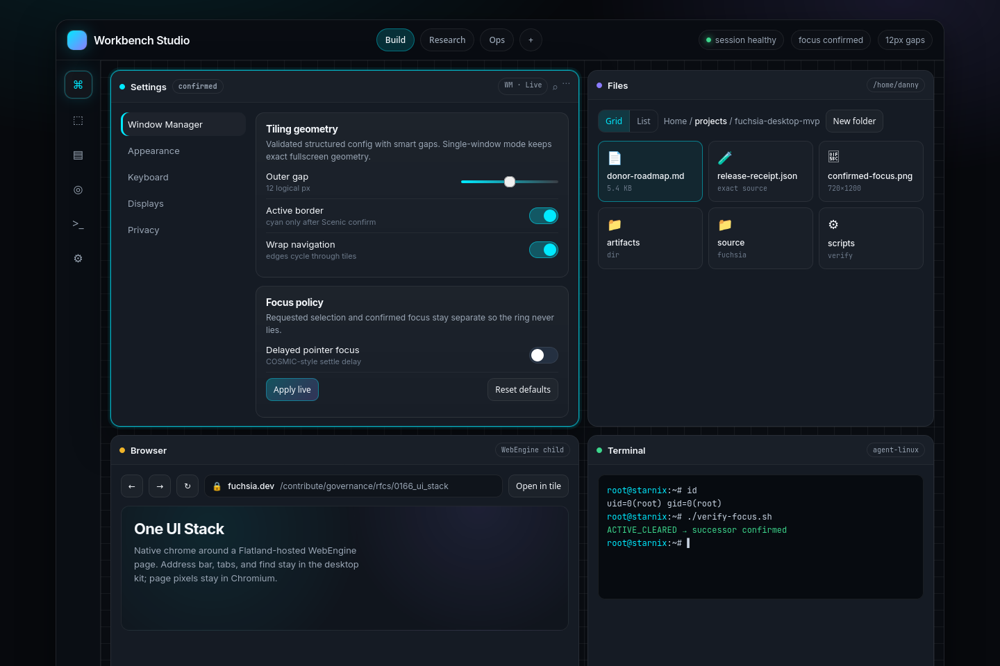

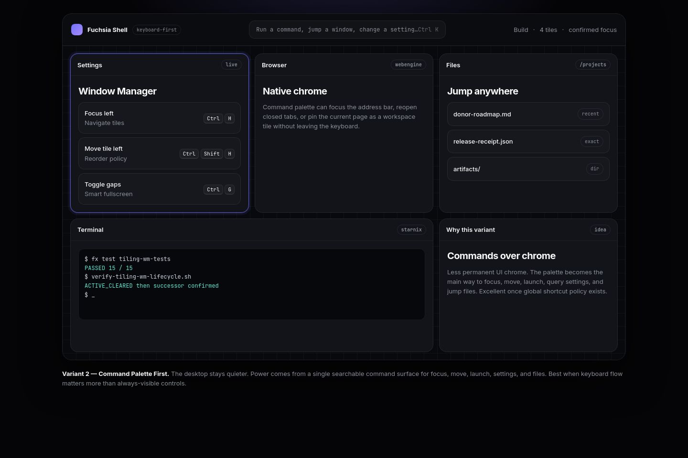

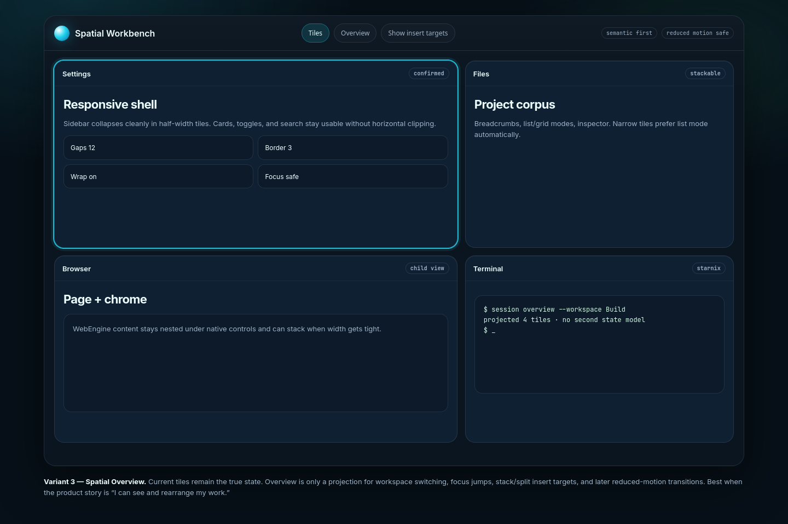

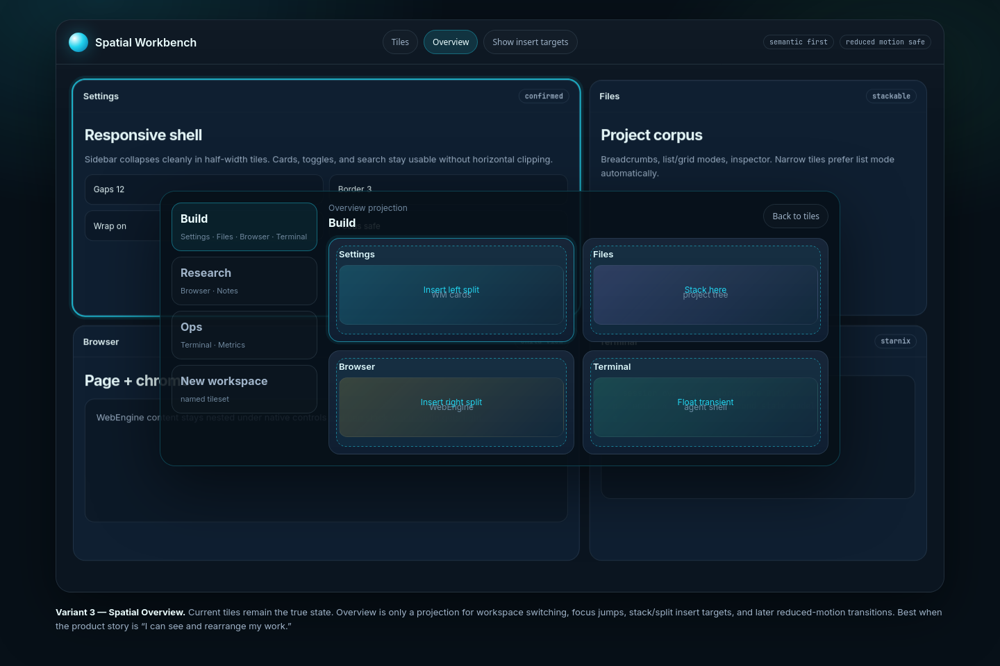

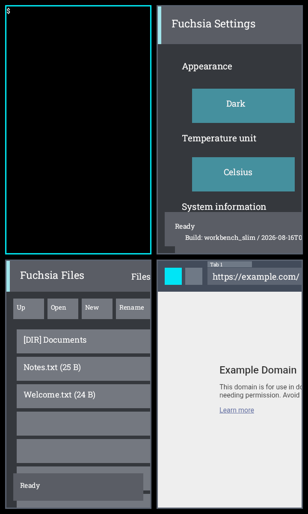

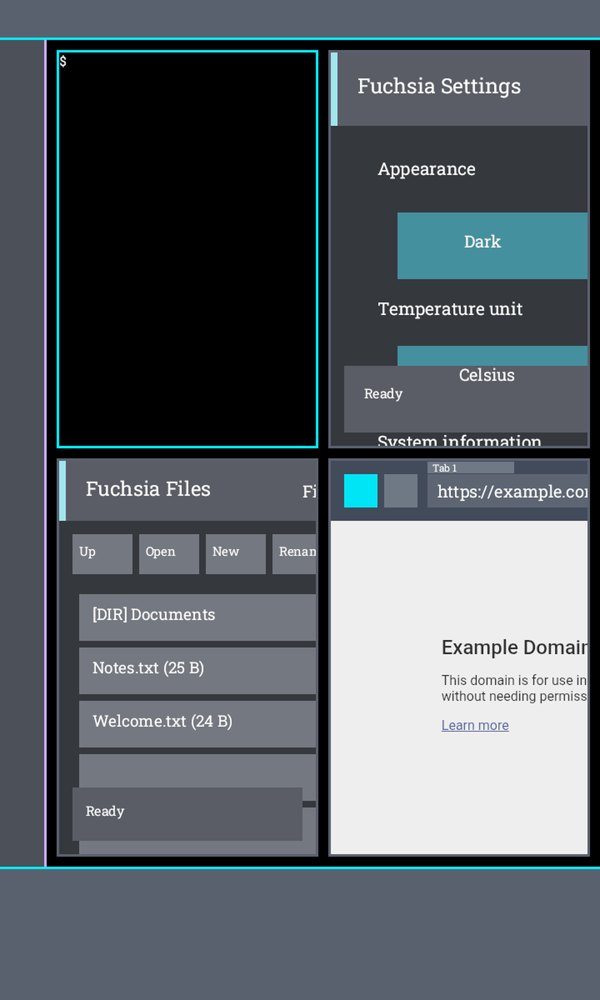

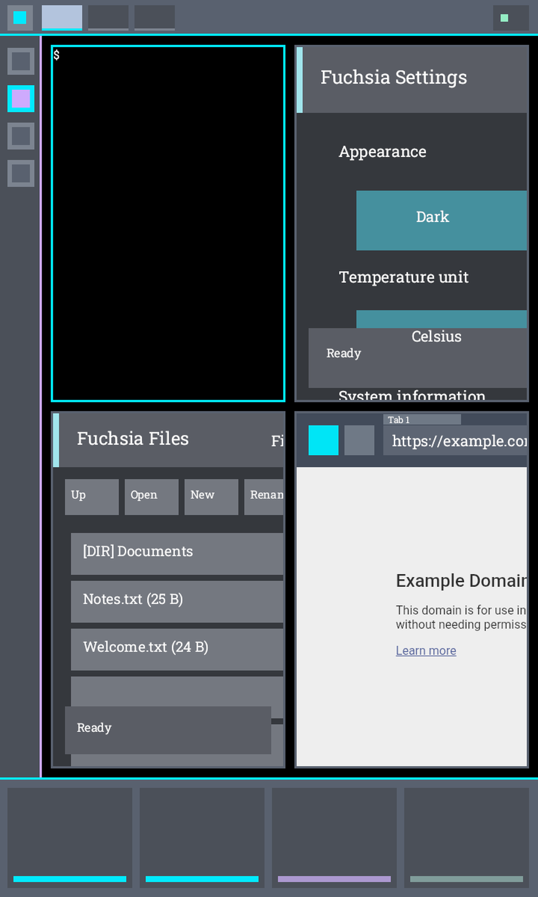

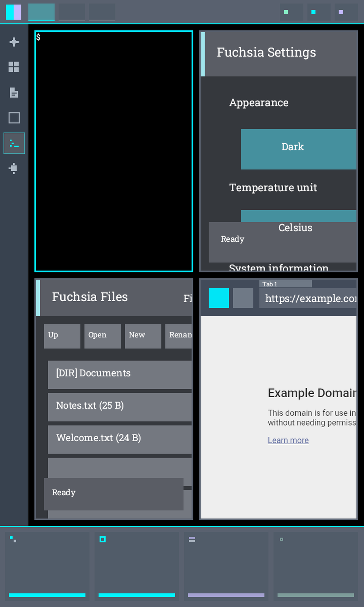

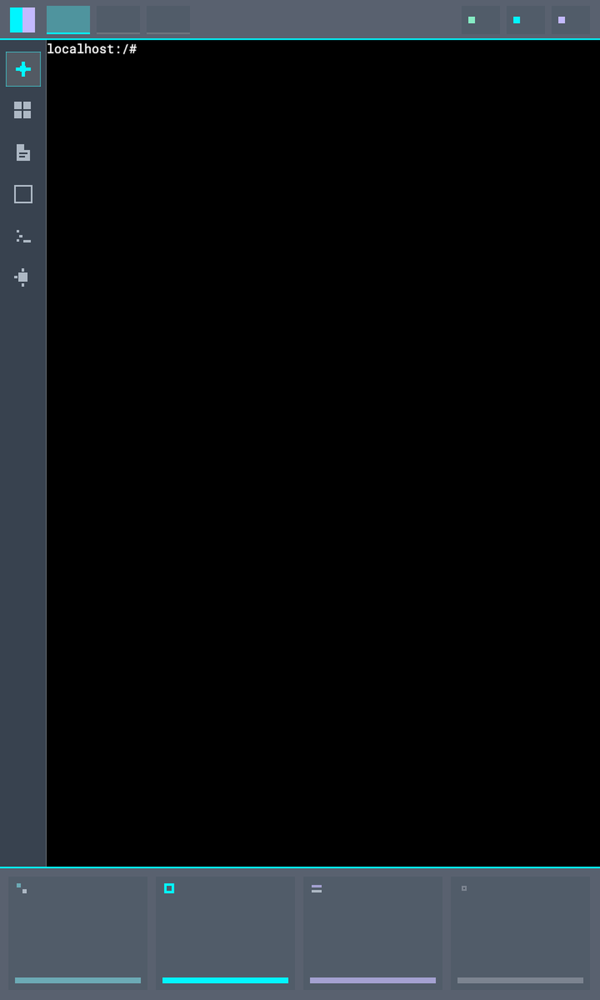

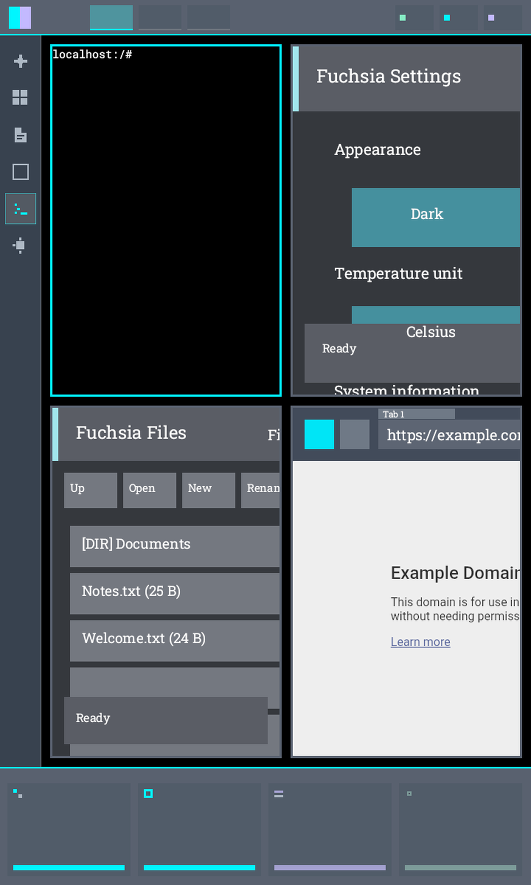

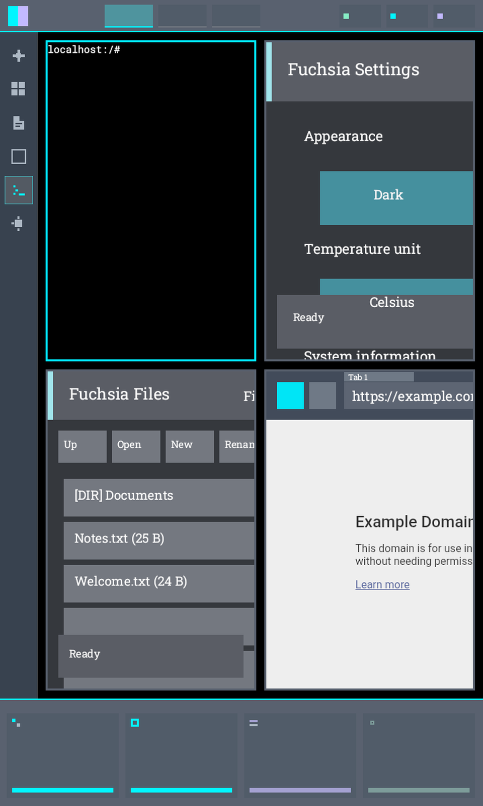

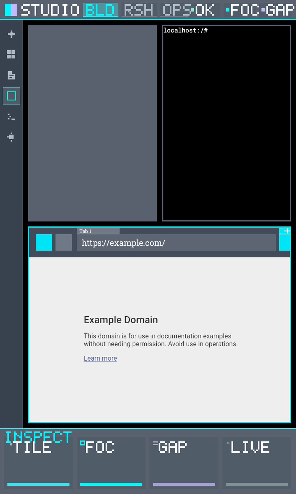

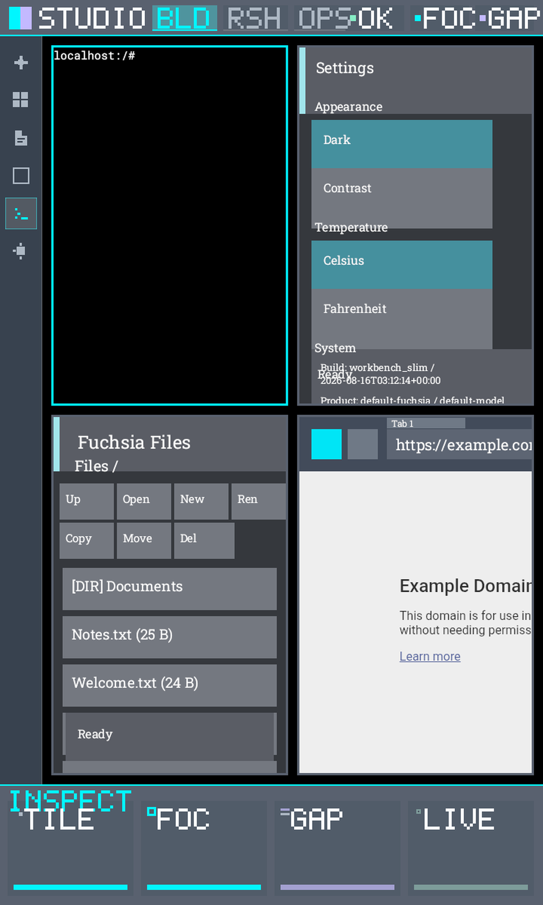

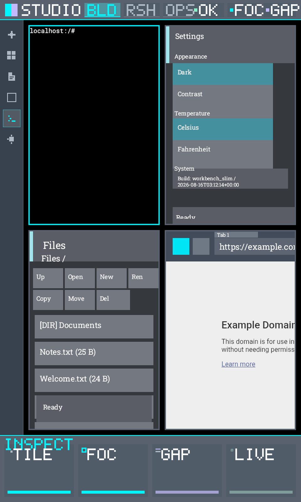

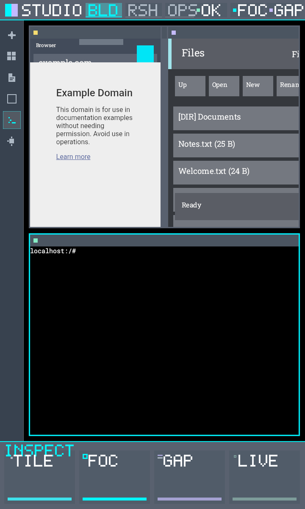

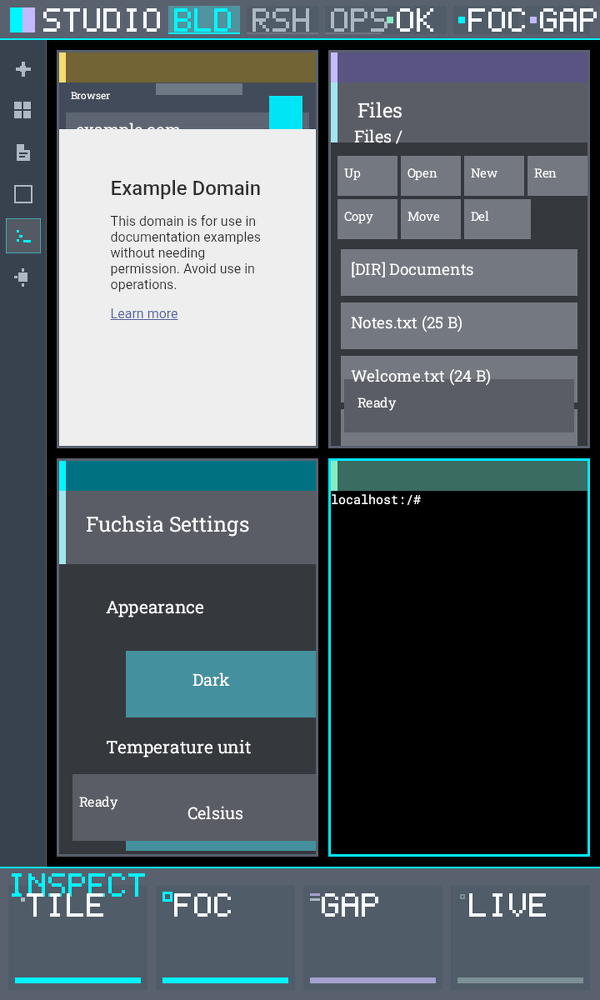

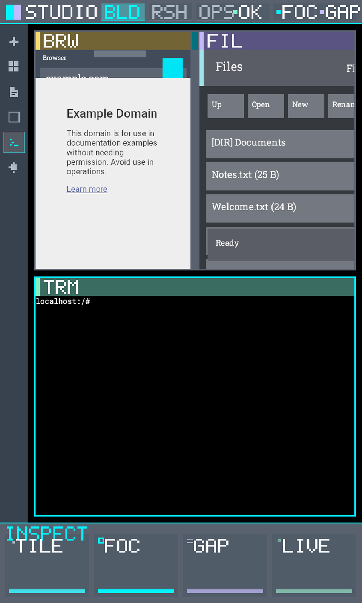

Interactive sketches live under `design/sketches/`.

## Local rebuild

### 1. Get public Fuchsia source at the pin

```bash
./scripts/fetch-fuchsia-source.sh ./source/fuchsia
```

Or follow upstream docs and check out the commit in `versions.env`.

### 2. Apply overlays

```bash
./scripts/apply-overlays.sh ./source/fuchsia
```

### 3. Configure and build Workbench slim

Inside your Fuchsia tree / container workflow:

```bash
fx set workbench_eng.x64 --release
fx build //products/workbench:workbench_slim.x64
```

Exact containerized flow used during development is documented in `docs/architecture.md` and the helper scripts under `scripts/`.

### 4. Optional runtime verification

With an emulator/session and local `sdk/` + `artifacts/` layout available:

```bash
./scripts/verify-tiling-wm-interaction.sh
./scripts/verify-tiling-wm-lifecycle.sh
./scripts/verify-slim-product.sh
```

These scripts will not fully run in a docs-only checkout without local fetches.

## Optional Starnix agent path

The agent-linux overlay is included without credentials.

1. Create your own keypair locally.
2. Install the public key using `authorized_keys.template` as a guide.
3. Export:

```bash
export AGENT_SSH_KEY=/absolute/path/to/private_key
export AGENT_KNOWN_HOSTS=/absolute/path/to/known_hosts
```

Never commit those files.

## Repository layout

```text
overlays/fuchsia/     # files to copy onto a Fuchsia checkout
scripts/              # fetch/apply/verify/secret-scan helpers
design/sketches/      # HTML UI directions
design/screenshots/   # PNG captures referenced by README
docs/                 # architecture + donor roadmap
.github/workflows/    # CI
versions.env          # pins
```

## Instrument Studio UI path

Shared native UI contracts live in `overlays/fuchsia/src/fuchsia-desktop/desktop_ui`.
Region/token mapping: `docs/instrument-studio-ui-map.md`.

Host contract test:

```bash
python3 scripts/test-desktop-ui-host.py
```

## Observability feedback loop

Instrument Studio development uses Fuchsia diagnostics as the feedback channel:

```bash
./scripts/collect-desktop-diagnostics.sh ./artifacts/diagnostics-run
cat ./artifacts/diagnostics-run/design-feedback.json
```

See `docs/observability-feedback-loop.md` for the Inspect tree and design checks.

## Linux terminal

Workbench terminal bridges to Alpine/Linux via Starnix. See `docs/linux-terminal.md`.

## Production status

See `docs/production-status.md` for an honest done/not-done gate.

## Live demo evidence

Rebuild proof + vision notes:

- `docs/evidence/instrument-studio-20260818T220823Z/`
- Live Inspect: 4 tiles, confirmed focus, gap/border config
- Remaining gap: Instrument Studio chrome (strip/rail/inspector)

## Status

Interactive tiling WM foundation is proven on the pinned detached source identity above. Richer Instrument Studio UI implementation is the next build phase tracked from this public package.
