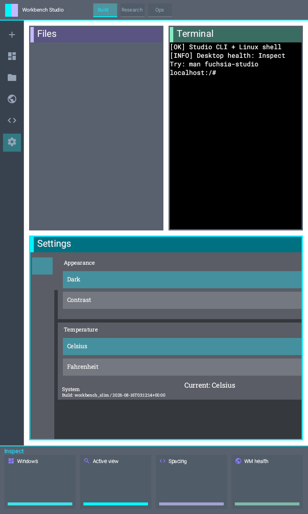

# Fuchsia Desktop Instrument Studio

Public package for a **native Fuchsia** desktop direction: Workbench + Flatland + interactive tiling window manager + four system apps, with Instrument Studio UI design sketches.

This repository does **not** vendor the multi-gigabyte Fuchsia tree, SDK, emulator images, or runtime state. It publishes the overlays, scripts, design artifacts, and instructions needed to rebuild on top of public Fuchsia sources.

## Security boundary

- No private keys, tokens, `.env` secrets, or `authorized_keys` material are included.
- `state/`, `sdk/`, `source/`, `artifacts/`, and caches are gitignored and must stay local.
- CI runs a fail-closed secret scan on every push.

If you find credential-like material, open an issue and rotate immediately.

## What you get

- `overlays/fuchsia/**`: native desktop overlays
  - interactive `tiling_wm` with confirmed-focus policy
  - Browser / Files / Settings / Terminal / panel spike components
  - Workbench session product wiring
- `scripts/**`: bootstrap, overlay apply, verification helpers
- `design/sketches/**`: interactive HTML directions for richer UI
- `design/screenshots/current-femu-run.png`: the screenshot from the documented FEMU run
- `design/screenshots/**`: older captures kept on disk, not embedded below
- `docs/donor-roadmap.md`: native-only roadmap adapted from mature Rust WMs
- GitHub Actions CI for public-readiness gates

## Pinned baseline

See `versions.env`:

- Fuchsia source: `85d1818a43cb152bf09a0a58ac571012f6ead5e7`
- Product target: `//products/workbench:workbench_slim.x64`

## Design direction

We are building **Instrument Studio** first:

1. shared native desktop chrome
2. confirmed-focus active window treatment
3. live WM settings surface
4. command palette and spatial overview as progressive layers

### Screenshots

The image below is the screenshot from running the documented FEMU path on 2026-09-29. It is the only run screenshot embedded here.



Visible pixels: Workbench Studio chrome with Build selected, and three tiles. Headers read Files, Terminal, and Settings. The Files body is empty. Terminal shows the studio help lines. Settings shows Appearance and Temperature. There is no fourth tile and no Browser page.

Inspect for that same run: health `OK`, `tile_count=3`, order `instrument-studio-browser,instrument-studio-terminal,instrument-studio-settings`, `last_present_context=RemoveTile`. The Files component was Running and was not in the tile order. The painted Files header and the Inspect order do not name the same first tile. This is not a four-app stage.

Older captures remain on disk under `design/screenshots/` and `docs/evidence/`. They are not this run, so they are not shown above.

Interactive sketches live under `design/sketches/`.

## Run the desktop

This repository is an overlay package. Cloning it does not boot a desktop. There is no emulator image, SDK, or product bundle in git.

The system this package produces is **Workbench slim on FEMU**. The commands below are the ones the live verifiers actually use. `scripts/start-emulator.sh` is not that path: it only starts QEMU `workbench_eng.x64` or `minimal.x64`.

### What has to exist first

- Linux x86_64 host with KVM (`/dev/kvm`) and rootless Podman
- A lab workspace that already has the SDK, Fuchsia source at the pin in `versions.env`, overlays applied, and a built slim bundle
- Container name `fuchsia-desktop-mvp`, isolate dir `/workspace/state/ffx`

On the lab used to develop this package, that workspace is `/srv/bigs-runtime/workspaces/projects/fuchsia-desktop-mvp`. The public clone of this repo is not a substitute for that lab.

Built bundle the guest actually boots:

```text
/workspace/source/fuchsia/out/workbench_eng.x64-release/obj/products/workbench/workbench_slim.x64/product_bundle
```

If that directory is missing, do the Local rebuild steps below, then come back here.

### 1. Start the tool container if it is not running

From the lab workspace, not from a docs-only clone:

```bash
podman compose up -d
podman ps --filter name=fuchsia-desktop-mvp --format '{{.Names}} {{.Status}}'
```

Expected: `fuchsia-desktop-mvp` is `Up`.

Helper used in every later command:

```bash
ffx() {
  podman exec -e FUCHSIA_NODENAME=fuchsia-workbench-femu fuchsia-desktop-mvp     /workspace/sdk/packages/tools/x64/ffx --isolate-dir /workspace/state/ffx "$@"
}
```

### 2. Boot FEMU, or reuse it if it is already running

```bash
ffx emu list
```

If the list shows `[running] fuchsia-workbench-femu`, do not start another copy.

If it is not running:

```bash
ffx emu start   --engine femu --gpu swiftshader_indirect --accel hyper --headless   --net user --smp 8 --name fuchsia-workbench-femu --startup-timeout 180   --log /workspace/artifacts/fuchsia-workbench-femu.log   /workspace/source/fuchsia/out/workbench_eng.x64-release/obj/products/workbench/workbench_slim.x64/product_bundle
```

The guest is headless. There is no local window and no VNC in this path. You look at it with `ffx target screenshot`.

### 3. Prove the guest is reachable

```bash
ffx target wait -t 180
ffx emu list
ffx target list
ffx target ssh "echo FUCHSIA_GUEST_OK"
```

Expected:

- emulator line `[running] fuchsia-workbench-femu`
- target `fuchsia-workbench-femu` in Product state with RCS `Y`
- guest prints `FUCHSIA_GUEST_OK`

### 4. Put the desktop on the stage without duplicates

A fresh slim boot can be an empty tiling WM (`tile_count=0`). A reused guest can already have the complete four-app stage. Read Inspect first so rerunning this runbook does not add duplicate windows:

```bash
wm_tile_count() {
  ffx --machine json inspect show core/session-manager/session:session/tiling_wm |
    python3 -c 'import json, sys

def find(value):
    if isinstance(value, dict):
        if "tile_count" in value:
            return value["tile_count"]
        for child in value.values():
            result = find(child)
            if result is not None:
                return result
    elif isinstance(value, list):
        for child in value:
            result = find(child)
            if result is not None:
                return result
    return None

result = find(json.load(sys.stdin))
if not isinstance(result, int):
    raise SystemExit("tiling_wm tile_count is unavailable")
print(result)'
}

tile_count="$(wm_tile_count)"
case "$tile_count" in
  0)
    ffx session add --name instrument-studio-settings fuchsia-pkg://fuchsia.com/fuchsia_settings#meta/fuchsia_settings.cm
    ffx session add --name instrument-studio-terminal fuchsia-pkg://fuchsia.com/fuchsia_terminal#meta/fuchsia_terminal.cm
    ffx session add --name instrument-studio-browser fuchsia-pkg://fuchsia.com/fuchsia_browser#meta/fuchsia_browser.cm
    ffx session add --name instrument-studio-files fuchsia-pkg://fuchsia.com/fuchsia_files#meta/fuchsia_files.cm
    ;;
  4)
    echo "four-app stage already present; not adding duplicates"
    ;;
  *)
    echo "unexpected existing tile_count=$tile_count; stop instead of creating a mixed or duplicate stage" >&2
    exit 1
    ;;
esac

stable_three=0
for attempt in $(seq 1 30); do
  tile_count="$(wm_tile_count)"
  if [ "$tile_count" -eq 4 ]; then
    break
  fi
  if [ "$tile_count" -eq 3 ]; then
    stable_three=$((stable_three + 1))
  else
    stable_three=0
  fi
  sleep 2
done

wm_tile_order() {
  ffx --machine json inspect show core/session-manager/session:session/tiling_wm |
    python3 -c 'import json, sys

def find(value):
    if isinstance(value, dict):
        if "order" in value and isinstance(value["order"], str):
            return value["order"]
        for child in value.values():
            result = find(child)
            if result is not None:
                return result
    elif isinstance(value, list):
        for child in value:
            result = find(child)
            if result is not None:
                return result
    return None

result = find(json.load(sys.stdin))
if not isinstance(result, str):
    raise SystemExit("tiling_wm order is unavailable")
print(result)'
}

order="$(wm_tile_order)"
case "$tile_count" in
  4)
    echo "tile_count=4"
    ;;
  3)
    test "$stable_three" -ge 3
    test "$order" = "instrument-studio-browser,instrument-studio-terminal,instrument-studio-settings"
    echo "tile_count=3 order=$order"
    ;;
  *)
    echo "tile wait ended at tile_count=$tile_count; refusing to inspect or screenshot an incomplete stage" >&2
    exit 1
    ;;
esac
```

Check the complete window-manager state:

```bash
ffx --machine json inspect show core/session-manager/session:session/tiling_wm
```

Expected from the 2026-09-29 run of this procedure: `tiling_wm.tile_count` is 3, `fuchsia.inspect.Health.status` is `OK`, order is `instrument-studio-browser,instrument-studio-terminal,instrument-studio-settings`, and `last_present_context` is `RemoveTile`. The Files component was Running and was not in that order. A component reporting `Running` is not a tile.
The wait does not stop at the first count of 3. It continues until the count is 4 or 30 attempts end. It then fails unless the count is 4, or the count is 3, that 3 held for at least three consecutive polls, and the order is exactly `instrument-studio-browser,instrument-studio-terminal,instrument-studio-settings`. A count of 0, 1, or 2 exits before Inspect or screenshot.

Capture pixels. `-d` requires an existing directory inside the tool container, so create its host-mounted counterpart first:

```bash
mkdir -p artifacts/instrument-studio-run
ffx target screenshot -d /workspace/artifacts/instrument-studio-run
```

The PNG lands in the lab `artifacts/instrument-studio-run/` directory on the host. The 2026-09-29 capture committed from that command is `design/screenshots/current-femu-run.png`. It shows three tiles, not four.

### 5. Use it as an end user inside Terminal

The Terminal is Alpine/Linux through Starnix. After Terminal has focus:

```sh
fuchsia-studio help
fuchsia-studio health
fuchsia-studio man
```

That is the in-guest help surface. Desktop health still comes from Inspect, not from those Linux commands.

### Stop

```bash
ffx emu stop fuchsia-workbench-femu
```

Do not run that if another session is using the same guest.

## Local rebuild

### 1. Get public Fuchsia source at the pin

```bash
./scripts/fetch-fuchsia-source.sh ./source/fuchsia
```

Or follow upstream docs and check out the commit in `versions.env`.

### 2. Apply overlays

```bash
./scripts/apply-overlays.sh ./source/fuchsia
```

### 3. Configure and build Workbench slim

Inside your Fuchsia tree / container workflow:

```bash
fx set workbench_eng.x64 --release
fx build //products/workbench:workbench_slim.x64
```

Exact containerized flow used during development is documented in `docs/architecture.md` and the helper scripts under `scripts/`.

### 4. Optional runtime verification

With an emulator/session and local `sdk/` + `artifacts/` layout available:

```bash
./scripts/verify-tiling-wm-interaction.sh
./scripts/verify-tiling-wm-lifecycle.sh
./scripts/verify-slim-product.sh
```

These scripts will not fully run in a docs-only checkout without local fetches.

## Optional Starnix agent path

The agent-linux overlay is included without credentials.

1. Create your own keypair locally.
2. Install the public key using `authorized_keys.template` as a guide.
3. Export:

```bash
export AGENT_SSH_KEY=/absolute/path/to/private_key
export AGENT_KNOWN_HOSTS=/absolute/path/to/known_hosts
```

Never commit those files.

## Repository layout

```text
overlays/fuchsia/     # files to copy onto a Fuchsia checkout
scripts/              # fetch/apply/verify/secret-scan helpers
design/sketches/      # HTML UI directions
design/screenshots/   # current run PNG plus older captures not embedded above
docs/                 # architecture + donor roadmap
.github/workflows/    # CI
versions.env          # pins
```

## Instrument Studio UI path

Shared native UI contracts live in `overlays/fuchsia/src/fuchsia-desktop/desktop_ui`.
Region/token mapping: `docs/instrument-studio-ui-map.md`.

Host contract test:

```bash
python3 scripts/test-desktop-ui-host.py
```

## Observability feedback loop

Instrument Studio development uses Fuchsia diagnostics as the feedback channel:

```bash
./scripts/collect-desktop-diagnostics.sh ./artifacts/diagnostics-run
cat ./artifacts/diagnostics-run/design-feedback.json
```

See `docs/observability-feedback-loop.md` for the Inspect tree and design checks.

## Linux terminal

Workbench terminal bridges to Alpine/Linux via Starnix and installs a bounded `fuchsia-studio` help, health, and manual command inside the Linux console. See `docs/linux-terminal.md`.

## Production status

See `docs/production-status.md` for an honest done/not-done gate.

## Live demo evidence

Current run, 2026-09-29, guest `fuchsia-workbench-femu`, product `workbench_slim.x64`:

- Reachable: RCS `Y`, guest printed `FUCHSIA_GUEST_OK`.
- Inspect: health `OK`, `tile_count=3`, order `instrument-studio-browser,instrument-studio-terminal,instrument-studio-settings`, `last_present_context=RemoveTile`.
- Files component was `Running` and was not in the tile order.
- Screenshot: `design/screenshots/current-femu-run.png`. Proof: `docs/evidence/instrument-studio-run-20260929T122200Z/`.

Older directories under `docs/evidence/` are historical. They are not this run.

## Status

The interactive tiling WM, Instrument Studio shell chrome, readable typography, semantic icons, and Linux help surface are visible in the current FEMU screenshot. That screenshot is not a four-app stage. The remaining release work includes a presented Files tile that matches Inspect, and the restart-only NativeTheme control plane, which is still a separate draft change and is not implied by this run.
